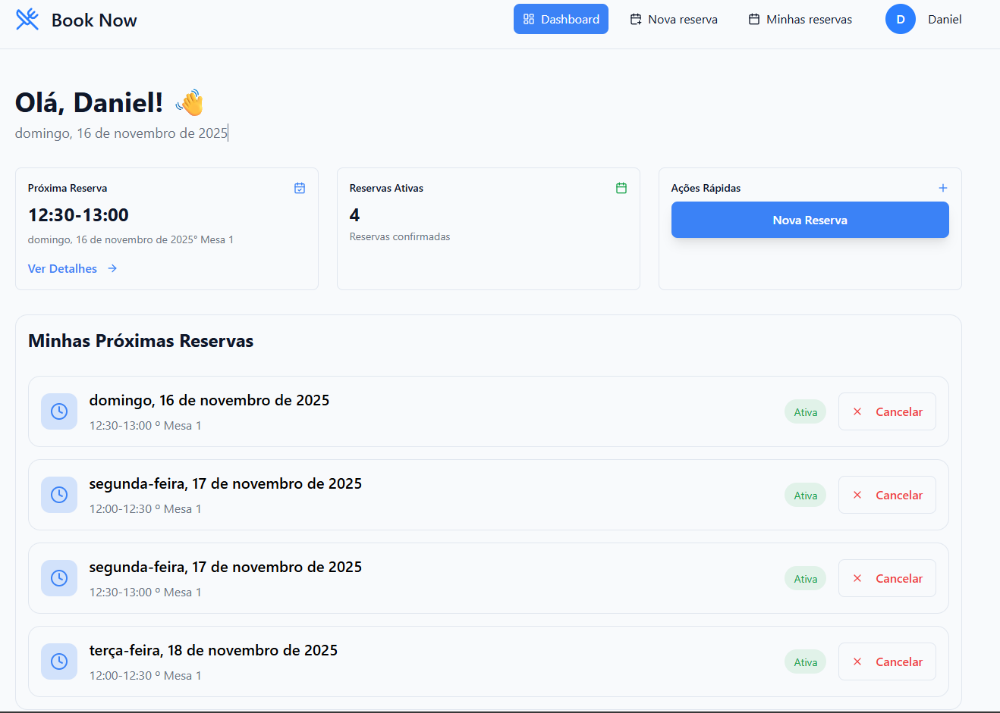
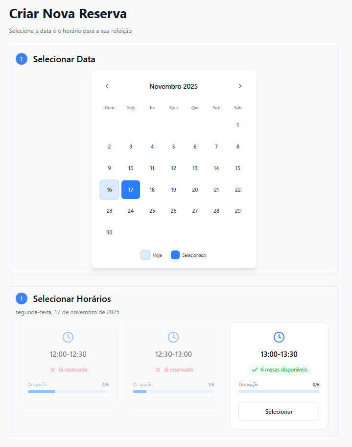
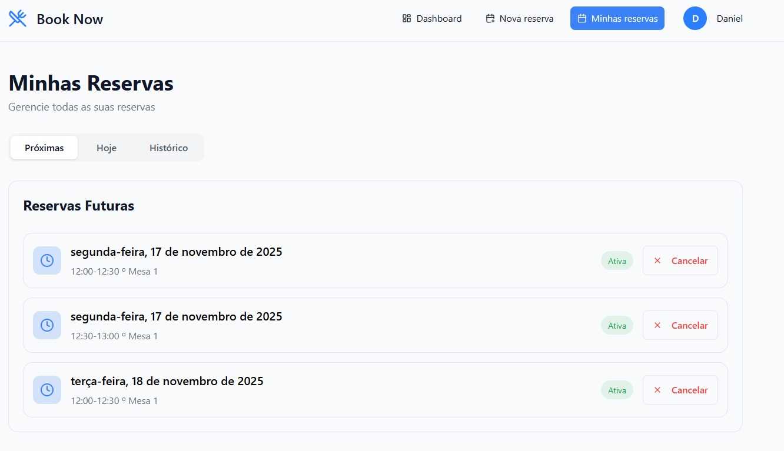

# Reserva de Mesas – Grupo Lucio

Sistema web para reserva de mesas no refeitório corporativo, desenvolvido como solução para o desafio técnico do Grupo Lucio.

---

## 📖 Descrição do Projeto
Aplicação web que permite colaboradores reservarem mesas em horários pré-definidos no refeitório, com autenticação, validação de regras de negócio e dashboard gerencial para administradores.

---

## 🛠️ Tecnologias Utilizadas
- **React 19 + TypeScript**
- **Vite** (build tool)
- **Tailwind CSS v4** (estilização)
- **React Router DOM** (roteamento)
- **Axios** (requisições HTTP)
- **Context API** (gerenciamento de estado)
- **Lucide-react** (ícones)
- **Supabase/PostgreSQL** (banco de dados e autenticação)
- **Firebase Hosting** (deploy e CI/CD)

---
## LINK

- Aplicação hospedada: [Book Now WEB](https://book-now-grupo-lucio.web.app/)
- **Credenciais de Teste**:
- Admin
  - Email: `admin@booknow.comr`
  - Senha: `admin123`
- Usuário
  - Email: `matheus@booknow.com`
  - Senha: `matheus123`
---

## 🏗️ Justificativa de Arquitetura & Decisões
- **Frontend desacoplado**: React + Vite para agilidade, hot reload e tipagem forte com TypeScript.
- **Tailwind CSS**: Rapidez na prototipação e responsividade garantida.
- **Context API**: Centralização do estado de autenticação e reservas, facilitando manutenção e escalabilidade.
- **Supabase**: BaaS gratuito, integra autenticação e banco de dados relacional, reduzindo tempo de setup e aumentando a segurança.
- **Firebase Hosting + GitHub Actions**: Deploy rápido, preview de PRs e integração contínua.
- **Validação de regras de negócio**: Helpers e lógica centralizada para garantir as restrições do desafio.
- **Componentização**: Reaproveitamento de UI e lógica, facilitando manutenção e testes.

---

## 📦 O que foi entregue
- [x] Cadastro e autenticação de colaboradores
- [x] Reserva de mesas por horário (12h-12h30, 12h30-13h, 13h-13h30)
- [x] Limite de 6 mesas por horário
- [x] Cada colaborador pode reservar até 2 horários por dia, 1 mesa por horário
- [x] Cancelamento de reservas
- [x] Dashboard gerencial para administradores
- [x] Status de disponibilidade dos horários
- [x] Interface responsiva e intuitiva
- [x] Validação de todas as regras de negócio
- [x] Deploy no Firebase Hosting
- [x] Documentação e instruções de uso

### ❌ O que não foi entregue (por tempo/prioridade)
- [ ] Edição de reservas já criadas
- [ ] Notificações por e-mail/SMS
- [ ] Testes automatizados (unitários/E2E)
- [ ] Painel de permissões avançadas
- [ ] Tela de perfil
- [ ] Tela de cadastro de horários e períodos
- [ ] Tela de cadastro de mesas


---

## ⏳ O que faria diferente com mais tempo
- Implementaria testes automatizados (unitários e E2E)
- Adicionaria notificações e lembretes
- Criaria painel de permissões e logs de auditoria
- Permitiria edição de reservas e gerenciamento de usuários
- Integração com Google Calendar

---

## 📝 Como rodar o projeto localmente

1. **Clone o repositório:**
   ```bash
   git clone https://github.com/codemathsz/book-now-app.git
   cd book-now-app
   ```
2. **Instale as dependências:**
   ```bash
   npm install
   ```
3. **Configure o arquivo `.env`:**
   ```env
   VITE_API_URL=http://localhost:3000/api
   ```
   > Altere para a URL do backend em produção se necessário.
4. **Rode o projeto:**
   ```bash
   npm run dev
   ```
5. **Acesse em:**
   [http://localhost:5173](http://localhost:5173)

---

## 📸 Prints do app em funcionamento





**Dúvidas ou sugestões?** Abra uma issue ou entre em contato!
